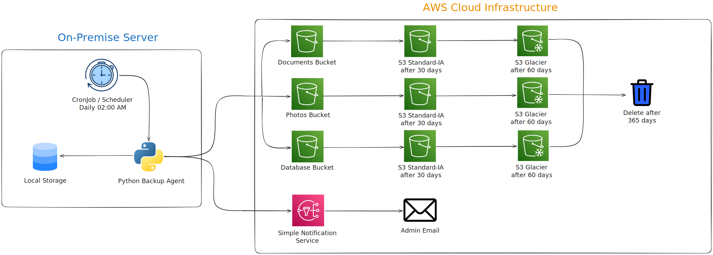
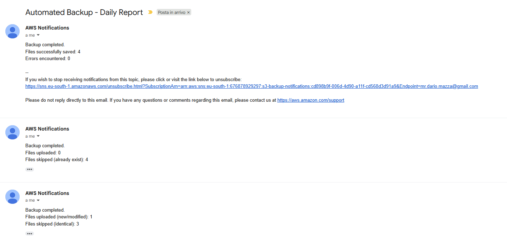

# Automated AWS S3 Backup System

## Project Overview
Small and medium-sized enterprises often rely on manual backup processes that are inconsistent and prone to human error. This project provides an automated, off-site backup solution using Amazon S3 to ensure data integrity, security, and cost-efficiency without manual intervention.

> **Why this matters:** Manual backups are often forgotten or fail silently. This system ensures **"Data Peace of Mind"** by combining automated scheduling with smart integrity checks, guaranteeing that your most critical business data is always versioned, archived, and recoverable without lifting a finger.

## Architecture
The following diagram illustrates the automated workflow. The On-Premise server triggers the backup process daily, synchronizing local data with specialized AWS S3 buckets.



## Technical Implementation
- **Smart Incremental Sync**: The script calculates the **MD5 hash** of local files and compares it with the S3 **ETag**. This ensures that any modification—even if the file size remains the same—is detected and backed up, while identical files are skipped to save time and costs.
- **Data Categorization**: The Python script automatically sorts files into specific S3 buckets (Documents, Photos, Database) based on file extensions.
- **Disaster Recovery**: S3 Versioning is enabled on all buckets to prevent accidental data loss and allow point-in-time recovery.
- **Cost Optimization**: Infrastructure is configured with S3 Lifecycle Policies. Data is automatically transitioned to lower-cost storage classes (Standard-IA and S3 Glacier) after 30 and 60 days.
- **Proactive Monitoring**: Integrated with Amazon SNS to deliver a status report via email after each execution.

## Tech Stack
- **Language**: Python 3.11 (Boto3 SDK)
- **Infrastructure as Code**: Terraform
- **Cloud Services**: Amazon S3, Amazon SNS, AWS IAM

## Automation and Scheduling
In a production environment, this system is designed to be fully autonomous. The backup script is intended to be scheduled as a **CronJob** on a local server or within a containerized orchestrator. 

Example configuration for a daily backup at 02:00 AM:
```bash
0 2 * * * /usr/bin/python3 /path/to/backup.py >> /var/log/s3_backup.log 2>&1
```
This ensures that data is backed up during off-peak hours, minimizing impact on network performance and ensuring consistent daily recovery points.

## Production Verification Logs
The following logs demonstrate a real execution of the system, showing the successful upload of files and the subsequent verification using the AWS CLI.

### 1. Python Script Execution
The script performs a smart incremental sync using MD5 checksums.

```text
2026-02-11 02:00:01,547 - INFO - Starting smart backup (MD5 check) from: ./sample_data
2026-02-11 02:00:01,711 - INFO - Uploading meeting_notes.txt to dariomazza-backup-documents...
2026-02-11 02:00:02,034 - INFO - File sample_image.jpg is identical (MD5 match), skipping.
2026-02-11 02:00:02,098 - INFO - File project_report.pdf is identical (MD5 match), skipping.
2026-02-11 02:00:02,335 - INFO - File prod_db_backup.sql is identical (MD5 match), skipping.
2026-02-11 02:00:02,335 - INFO - Backup completed.
Files uploaded (new/modified): 1
Files skipped (identical): 3
Errors encountered: 0
2026-02-11 02:00:02,534 - INFO - SNS notification sent successfully.
```

### 2. AWS Infrastructure Verification
Verifying the content of the S3 buckets confirms that the files were correctly routed and stored.

**Bucket: Documents**
```bash
$ aws s3 ls s3://dariomazza-aws-backup-2026-documents
2026-02-11 02:00:02         71 meeting_notes.txt
2026-02-11 02:00:02        490 project_report.pdf
```

**Bucket: Photos**
```bash
$ aws s3 ls s3://dariomazza-aws-backup-2026-photos
2026-02-11 02:00:02    1798761 sample_image.jpg
```

**Bucket: Database**
```bash
$ aws s3 ls s3://dariomazza-aws-backup-2026-database
2026-02-11 02:00:02        128 prod_db_backup.sql
```

### 3. SNS Email Notification
After each backup execution, the system sends an automated summary report via Amazon SNS. Below are examples of the email notifications received, detailing the status of the synchronization and any skipped files.



## Business Impact
- **Operational Reliability**: Eliminates human error by automating the entire backup lifecycle.
- **Data Durability**: Leverages AWS infrastructure (99.999999999% durability).
- **Financial Efficiency**: Reduces storage costs through automated data tiering.
- **Scalability**: Capable of handling increasing data volumes without code modification.
